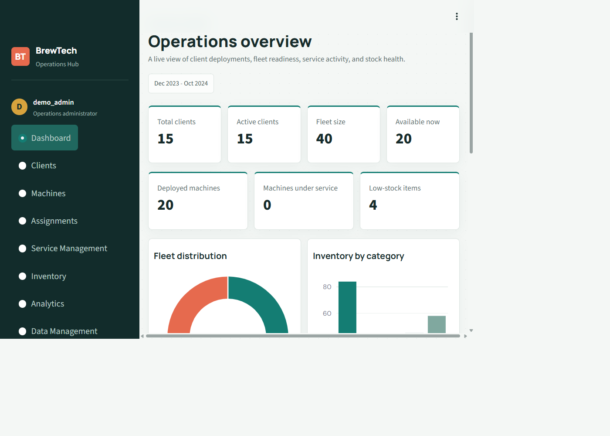
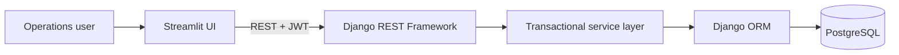
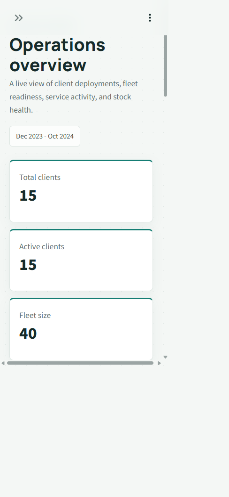

# BrewTech Operations Hub

[](https://github.com/kruthikbv/brewtech-operations-hub/actions/workflows/ci.yml)

A full-stack operations platform for managing beverage-machine fleets, client deployments, service records, inventory movements, dashboards, analytics, and Excel data exchange.



## Architecture



Streamlit never connects directly to PostgreSQL. All reads and writes pass through authenticated backend APIs and transactional service functions.

## Features

- JWT login, refresh, logout, and protected API access
- Client and machine management with filtering, search, and pagination
- Atomic machine assignment and return workflows
- Service lifecycle handling with machine-status restoration
- Locked stock-in and stock-out transactions that prevent negative inventory
- Activity logs, KPI dashboard, and Plotly operational analytics
- Validated Excel imports and in-memory Excel exports
- Swagger UI and OpenAPI schema
- Responsive Streamlit interface for desktop and mobile
- Repeatable fictional Bengaluru demo data dated December 2023 through October 2024

## Technology

Python 3.12, Django 5, Django REST Framework, PostgreSQL 16, SimpleJWT, Streamlit, Pandas, Plotly, OpenPyXL, django-filter, drf-spectacular, Gunicorn, WhiteNoise, Docker, and GitHub Actions.

## Quick Start

### 1. Environment

```powershell
git clone https://github.com/kruthikbv/brewtech-operations-hub.git
cd brewtech-operations-hub
python -m venv .venv
.venv\Scripts\Activate.ps1
pip install -r backend/requirements.txt -r frontend/requirements.txt
copy backend/.env.example backend/.env
copy frontend/.env.example frontend/.env
```

Set a strong `DJANGO_SECRET_KEY` in `backend/.env`. To use PostgreSQL, also set its `POSTGRES_*` values. Without `POSTGRES_PASSWORD`, Django uses SQLite for local development only.

### 2. Backend

```powershell
python backend/manage.py migrate
python backend/manage.py seed_demo_data
python backend/manage.py runserver
```

### 3. Frontend

In a second terminal:

```powershell
.venv\Scripts\Activate.ps1
streamlit run frontend/app.py
```

Open:

- Streamlit: http://127.0.0.1:8501
- Swagger: http://127.0.0.1:8000/api/docs/
- OpenAPI: http://127.0.0.1:8000/api/schema/

Demo login: `demo_admin` / `demo-password`

## Full Docker Stack

Create a root `.env` file containing at least:

```text
POSTGRES_DB=brewtech_db
POSTGRES_USER=brewtech_user
POSTGRES_PASSWORD=choose-a-strong-local-password
DJANGO_SECRET_KEY=choose-a-long-random-secret
```

Then run:

```powershell
docker compose up --build -d
docker compose exec backend python manage.py seed_demo_data
```

The stack starts PostgreSQL, Django/Gunicorn, and Streamlit with health-aware service ordering and persistent database storage.

## Testing

```powershell
python backend/manage.py check
python backend/manage.py makemigrations --check --dry-run
python backend/manage.py spectacular --validate --file schema.yml
python backend/manage.py test clients machines inventory service_records accounts dashboard
python -m compileall -q backend frontend
```

GitHub Actions repeats migration, deployment, OpenAPI, static asset, test, and compilation checks against PostgreSQL 16 on every push and pull request.

## Production Checklist

- Set `DJANGO_DEBUG=False`
- Use managed PostgreSQL and `POSTGRES_SSLMODE=require`
- Configure `DJANGO_ALLOWED_HOSTS` and `DJANGO_CSRF_TRUSTED_ORIGINS`
- Enable `DJANGO_SECURE_SSL_REDIRECT=True`
- Set `DJANGO_SECURE_HSTS_SECONDS=31536000` after confirming HTTPS
- Point `BACKEND_API_BASE_URL` at the deployed Django `/api/v1` endpoint
- Replace or disable the public demo credentials

The backend image runs migrations, collects static assets, and serves Django with Gunicorn. The frontend image serves Streamlit independently.

## Project Structure

```text
backend/      Django API, services, models, migrations, tests
frontend/     Streamlit UI, API clients, authentication, Excel helpers
docs/         PostgreSQL notes, index rationale, screenshots
sample_data/  Import sample location
```

## Mobile View



> All included names, organizations, contact details, and operational records are fictional and created solely for demonstration.
